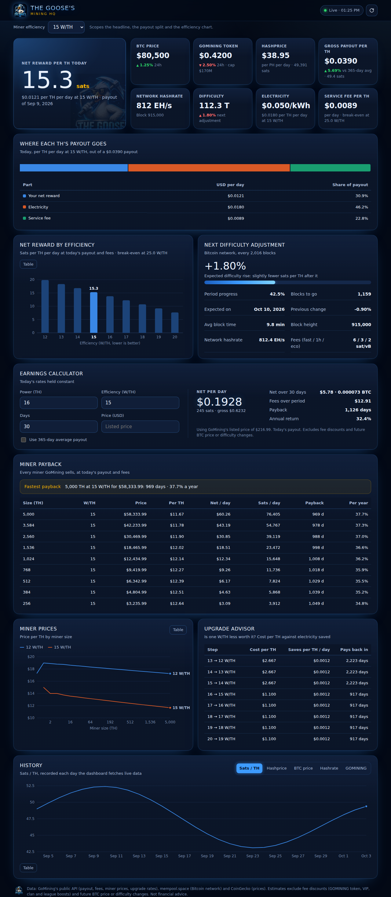

# HONKSQUAD · Mining HQ (GoMining Hub)

A public GoMining website and an MCP server for Claude, built on one shared data layer, so the numbers on screen and the numbers Claude quotes always match. **Every number comes from GoMining itself** (its live public API, its documentation and its official VIP table) or from a named public source (mempool.space, CoinGecko, alternative.me). Anything GoMining shows only inside an account, such as the weekly Mining mode discount or Simple Earn APRs, is typed in by the visitor and never guessed. For their own balances and rewards, players connect GoMining's official MCP (`https://mcp.gomining.com/mcp`) in Claude.

- **Dashboard** in The Goose's brand, led by the **Goose Calculator** (rewards per day/week/month/year with your maintenance discount, in USD, BTC, sats and GOMINING; and an investment plan that simulates monthly buys and reinvesting), then: net reward per TH, BTC and GOMINING prices (24h change), hashprice, payout vs the 365-day average, network hashrate and difficulty, the next difficulty adjustment, where each TH's payout goes, net reward by efficiency with break-even, payback and annual return for every miner GoMining sells, an upgrade advisor, miner prices, and history charts (sats/TH, hashprice, BTC, hashrate, GOMINING). Works on a phone.
- **Miner Wars**: every league's live clan board (all leagues from GoMining's league list), clan search across all leagues, a week in any clan vs plain mining under GoMining's rules, the best clans for your miners (with each clan's blocks-vs-power ratio, so spell-driven clans stand out), points per second, GoMining's published round-multiplier odds, and spell prices.
- **Planning**: profit per TH by BTC price and W/TH, efficiency upgrades vs more TH for a budget, Simple Earn vs mining.
- **GOMINING token**: every weekly Burn & Mint cycle since 2023 (burned, minted, net, the share of votes for burning read back from GoMining's mint formula), the current epoch's progress, a veGOMINING lock simulator (votes, VIP level and how long it holds, rewards at GoMining's yearly income per vote), and a daily price calendar for BTC and GOMINING.
- **Platform**: GoMining's public counters (users, hashrate, upgrades, BTC paid, Miner Wars, Simple Earn, locked tokens, secondary market) and a guide to GoMining's official MCP connector for personal stats.
- **Outlook**: break-even BTC price per W/TH, what the next difficulty adjustment does to your sats per TH, the halving countdown and the crypto Fear & Greed index.
- **Discount builder**: GoMining's maintenance discount from its parts (GOMINING balance coverage up to 20%, VIP level up to 6%, Service Button up to 3%, 29% together), plus the Mining mode discount the visitor copies from their app (GoMining changes it weekly), how much GOMINING the next step needs, and maintenance cost in GOMINING.
- **VIP level and Simple Earn**: your VIP level from TH or veGOMINING votes (GoMining's official table), all its perks (discount, Simple Earn multiplier, Instant Funds fee, Launchpad, reinvest bonus, royalty) and what the next level needs; Simple Earn for all seven assets at the APR your wallet shows times your VIP multiplier, in BTC or in TH (+10%, $0.10 per cycle minimum).
- **Investment plan**: simulated day by day, reinvesting under GoMining's rules (10 to 5,000 TH, better than 20 W/TH, at least $0.10 a day, VIP bonus).
- **Layout**: grouped into Today, Calculators, Planning, Miner Wars, GOMINING, Platform, Market & miners and History, with a sticky section menu.
- **MCP server**: the same data as tools Claude can call, plus a passthrough for your own GoMining account endpoints.



```
gomining-hub/
  src/core/      GoMining client, calculations, cached market service (shared)
  src/web/       dashboard server (no dependencies) and JSON API
  src/mcp/       MCP server for Claude
  public/        dashboard page, styles and SVG charts
  data/          offline snapshot; history.json is written here at runtime
  deploy/        VPS install: systemd service, Caddy/nginx site, preflight check
  test/          node:test suite against a fake GoMining API
```

## Run it

Requires Node.js 20 or newer.

```bash
cd gomining-hub
npm install
npm test
npm start          # dashboard at http://127.0.0.1:4173
```

`PORT` and `HOST` change where the dashboard listens. It binds to localhost by default.

## Where the data comes from

Three public GoMining endpoints, the same ones app.gomining.com calls without logging in:

| Endpoint | Gives |
|---|---|
| `POST /api/nft-income-aggregation/get-last` | Daily payout per TH, the BTC price used, electricity and service fees |
| `GET /api/nft-collection/find-all-generative` | Miners GoMining sells, with prices |
| `POST /api/nft/get-upgrade-rate` | Per-W/TH valuation and upgrade price tables |

More public GoMining endpoints (no token; the same calls the app makes):

| Endpoint | Gives |
|---|---|
| `POST /api/nft-game/league/index` | Every Miner Wars league this cycle with its round-multiplier odds (asked as of the cycle start; kept an hour) |
| `POST /api/nft-game/clan-leaderboard/index-v2` | Clans in a league: position, blocks, TH, zone, prize fund, weighted W/TH and discount (kept 10 minutes) |
| `POST /api/nft-game/nft-game-ability/find-all` | Miner Wars spells and their GOMINING prices |
| `GET /api/platform-statistics`, `POST /api/nft/marketplace-statistics` | Platform counters and one-day changes |
| `POST /api/ve-gomining-lock/statistics` | veGOMINING locked and votes per network, yearly income per vote |
| `POST /api/mint-and-burn/index`, `POST /api/mint-and-burn/get-epoch-start-date` | Every weekly Burn & Mint cycle, and when the current epoch began |

The rules (fee formula, discounts, VIP perks, reinvest rules, Miner Wars rewards and maintenance, PPS, epochs, the mint formula, Simple Earn) come from [docs.gomining.com](https://docs.gomining.com) and [gomining.com/vip](https://gomining.com/vip), checked 4 October 2026.

Context from three keyless public sources, each optional (its panel says "unavailable" if it's down, never sample data):

| Source | Gives |
|---|---|
| mempool.space | Network hashrate, difficulty, next adjustment (progress, expected change, date), block height, fees |
| CoinGecko | BTC and GOMINING prices with 24h change and market cap; top 50 coins by market cap for the ticker bar (fetched at most once a minute); 365 days of daily closes for the price calendar (every 6 hours) |
| alternative.me | Crypto Fear & Greed index (today, yesterday, a week ago) |

Results are cached for 5 minutes. The refresh button skips the cache.

**When GoMining can't be reached**, each part falls back to `data/sample-snapshot.json`: real GoMining responses captured on 9 Sep 2026 (via the public [gmt-calculator](https://github.com/sergeevpasha/gmt-calculator) snapshot). The dashboard shows a yellow "Sample data" badge and a notice, and every MCP tool returns `dataSource: "sample"`, so sample figures are never passed off as today's.

**Payout history**: GoMining's API has no history endpoint. Each day the hub fetches a live payout it saves one point to `data/history.json`, keyed by payout date, so the history chart builds up while you use it.

**Estimates**: net = payout − electricity (per W/TH × your W/TH) − service fee, per TH per day, with today's rates held constant. This is GoMining's own formula, net = payout − (electricity + service) × (1 − discounts). The calculators apply the maintenance discount you enter (GOMINING payment up to 20%, VIP up to 6%, Service Button up to 3%, plus the weekly Mining mode discount from your app). Everything is **pre-halving**: the next halving (about April 2028) halves the BTC paid per TH, and BTC's price after it can't be predicted, so it isn't modelled. Future BTC price, difficulty and fee changes aren't either.

**Miner Wars**: leagues and boards are read for the current cycle (Tuesday to Tuesday UTC) from GoMining's league list, so new Dune divisions appear by themselves. A clan's BTC is gross. For a member, GoMining takes a full week of maintenance on all their TH out of their share, never below zero, charges any reward above Mining-mode output at the league's average W/TH and discount, and the joining day earns no Mining mode reward; the comparison follows those rules. Rounds are weighted by multipliers that can't be known in advance, so weekly projections treat them as equal. After a failed fetch a board isn't asked for again for 10 minutes and the last good one is served.

## Dashboard API

| Route | Returns |
|---|---|
| `GET /api/market` | Payout, miner prices, upgrade tables, efficiency curve, data source. `?refresh=1` skips the cache |
| `GET /api/history` | Recorded payout days |
| `GET /api/minerwars/leagues` | Every league this cycle with its multiplier odds |
| `GET /api/minerwars/board?league=3` | One league's clan board, prize fund and BTC per block |
| `GET /api/minerwars/search?q=name` | Clans by name across every league |
| `GET /api/minerwars/spells` | Spells on sale and their GOMINING prices |
| `GET /api/platform` | Platform statistics and veGOMINING totals |
| `GET /api/tokenomics` | Burn & Mint history, the current epoch, veGOMINING income per vote |
| `GET /api/prices/history` | 365 days of daily BTC and GOMINING closes |
| `GET /api/earnings?powerTh=16&efficiencyWth=15&days=30[&priceUsd=250][&average=1]` | Earnings and payback |

The account passthrough is not exposed over HTTP: neither the dashboard nor the remote MCP connector has it or the token. Only the local MCP server (stdio, inside Claude on your PC) can use your token.

## Connect the MCP server to Claude

### Claude Desktop

Edit `claude_desktop_config.json` (Windows: `%APPDATA%\Claude\claude_desktop_config.json`) and restart Claude Desktop:

```json
{
  "mcpServers": {
    "gomining": {
      "command": "node",
      "args": ["D:\\Projects\\atlas\\gomining-hub\\src\\mcp\\index.js"],
      "env": { "GOMINING_TOKEN": "" }
    }
  }
}
```

Change the path to wherever you cloned the repo. Leave `GOMINING_TOKEN` empty to use only the public tools.

### Claude Code

```bash
claude mcp add gomining -e GOMINING_TOKEN=your-token -- node /path/to/atlas/gomining-hub/src/mcp/index.js
```

### Tools

| Tool | What it does |
|---|---|
| `gomining_daily_reward` | Payout per TH (USD, sats), BTC price, electricity, service fee; optional per-TH split for one W/TH |
| `gomining_miner_prices` | Miners for sale, filterable by efficiency and budget |
| `gomining_upgrade_rates` | Valuation and upgrade cost tables per W/TH |
| `gomining_efficiency_curve` | Net per TH at 12–20 W/TH and the break-even efficiency |
| `gomining_calculate_earnings` | Daily and period net in USD, sats and BTC, payback and annual return |
| `gomining_miner_roi` | Payback and annual return of every miner for sale |
| `gomining_upgrade_advisor` | Cost vs electricity saved for each W/TH upgrade step |
| `gomining_network_stats` | Bitcoin network stats and BTC/GOMINING prices |
| `gomining_outlook` | Break-even BTC price per W/TH, next difficulty adjustment impact, halving countdown, Fear & Greed |
| `gomining_maintenance_discount` | Discount from GOMINING balance, VIP level, Service Button days and the Mining mode % from your app, and the GOMINING needed for the next step |
| `gomining_vip` | VIP level from TH or veGOMINING, its perks, the next level, and optional Simple Earn rewards at your wallet's APR |
| `gomining_miner_wars_leagues` | Every league this cycle, with GoMining's multiplier odds |
| `gomining_miner_wars_board` | Any league's clan board, or a clan found by name; optional week in that clan vs plain mining |
| `gomining_clan_finder` | Every clan in a league ranked by what a week would pay your miners, and your points per second |
| `gomining_spells` | Spells on sale and their GOMINING prices |
| `gomining_platform_stats` | GoMining's platform counters and veGOMINING totals |
| `gomining_tokenomics` | Burn & Mint history, epoch progress, veGOMINING income per vote; optional lock simulation |
| `gomining_planner` | Profit matrix by BTC price and W/TH, efficiency vs power for a budget, Simple Earn vs mining |
| `gomining_payout_history` | Recorded payout days |
| `gomining_api_request` | Any `https://api.gomining.com/api/...` endpoint, with your token (local server only, not on the remote connector) |
| `gomining_status` | Token set, writes allowed, live or sample data |

Try: "What does a 16 TH miner at 15 W/TH earn per month on GoMining, and when does it pay back?"

## Your account data

The easiest way for anyone to see their own GoMining account in Claude is GoMining's official, read-only MCP connector: in Claude, Customize → Connectors → Add custom connector, URL `https://mcp.gomining.com/mcp`, then sign in to GoMining. The rest of this section is for running this project's local MCP with your own token.

### Token for the local MCP server

GoMining has no public API key. The MCP server can use the bearer token the web app sends:

1. Log in at app.gomining.com in Chrome and open DevTools (F12), **Network** tab, filter `api.gomining.com`.
2. Click around (miners, wallet, clan) and select a request.
3. Under **Request Headers**, copy the `Authorization` value after `Bearer `.
4. Put it in `GOMINING_TOKEN` in your Claude config.

The token gives full access to your GoMining account, so treat it like a password. Keep it only in your local Claude config and never commit it. When calls start returning HTTP 401, the session has expired; copy a fresh token.

The account endpoints aren't documented, so find them in the same Network tab and ask Claude to call them through `gomining_api_request` with the path and body you see there.

**Safety limits**: the token is only ever sent to `https://api.gomining.com`, and absolute URLs, `//host`, `..` and encoded `%2e` paths are refused. Public market calls never send it. `PUT`, `PATCH` and `DELETE` are blocked unless `GOMINING_ALLOW_WRITES=1`. GoMining also uses `POST` for some actions, so check what an endpoint does before asking Claude to call it.

## Configuration

| Variable | Default | Purpose |
|---|---|---|
| `GOMINING_TOKEN` | unset | Bearer token for account endpoints (MCP only). A leading `Bearer ` is stripped |
| `GOMINING_BASE_URL` | `https://api.gomining.com/api` | API base URL |
| `GOMINING_ALLOW_WRITES` | unset | `1` allows PUT, PATCH and DELETE through `gomining_api_request` |
| `PORT` / `HOST` | `4173` / `127.0.0.1` | Where the dashboard listens |
| `GOMINING_HISTORY_PATH` | `data/history.json` | Where recorded payout days are saved |
| `MCP_ACCESS_KEY` | unset | Enables the remote MCP endpoint at `/mcp/<key>` (32+ characters). Generated by the installer |

## Deploy to thegooses.online

One command on the VPS installs everything: Node.js and Caddy if missing, the dashboard as a service, HTTPS for your domain, and a private MCP endpoint for Claude. No credentials are stored in this repo; the MCP secret is generated on the VPS.

1. **DNS:** at your domain registrar, set an `A` record for `thegooses.online` (name `@`) to the VPS's IP address.
2. **Install,** from a terminal on your PC (uses your existing SSH shortcut):
   ```bash
   ssh goose-vps "rm -rf /tmp/atlas && git clone -q --depth 1 -b claude/inspiring-gates-3sh557 https://github.com/zarasla/atlas /tmp/atlas && bash /tmp/atlas/gomining-hub/deploy/install.sh thegooses.online"
   ```
3. **Connect Claude:** the last lines print your connector URL (`https://thegooses.online/mcp/<secret>`). In Claude go to Settings → Connectors → Add custom connector and paste it. Keep that URL private; it's the key to the tools.

That command is for a first install. To update a running server, pull the branch in `/tmp/atlas` and run `deploy/update.sh` (see HANDOVER.md §8). Payout history and the MCP secret are kept. `bash deploy/check.sh thegooses.online` on the VPS is a read-only check of what's running there.

The installer only adds its own site. If an existing Caddy or nginx config fails the config test, it restores the previous config and reloads nothing. It doesn't stop or change other services such as the Goose Discord bot.

The remote connector is public data only: it never loads `GOMINING_TOKEN` and has no `gomining_api_request`, so a leaked connector URL can't touch an account. Use the local MCP server for account tools. Status and logs: `systemctl status gomining-hub`, `journalctl -u gomining-hub -f`.

### Security on the VPS

- The dashboard serves public GoMining data only. It never loads `GOMINING_TOKEN`, even if one is set, and has no route that can reach your account.
- It listens on `127.0.0.1` only; Caddy or nginx is the only thing exposed.
- The service runs as an unprivileged user with a read-only filesystem except its history folder.
- Responses carry a strict Content-Security-Policy and refuse framing.
- A forced refresh is limited to once a minute, so the public refresh button can't be used to hammer GoMining.
- The remote MCP endpoint answers only at `/mcp/<secret>` (64 random hex characters, compared in constant time); any other path gets a plain 404. The secret lives in `/etc/gomining-hub.env` (root-only).
- Neither the dashboard nor the remote MCP loads `GOMINING_TOKEN`; only the local MCP server on your PC does, if you give it one.
- Miner Wars, platform and Burn & Mint fetches are cached and back off for 10 minutes after a failure, so visitors can't make the server hammer GoMining.

### Keeping secrets out of the repo

`npm test` includes a scan of every file in the repository for private keys, tokens (GoMining, GitHub, Discord, Telegram, Anthropic, AWS), hard-coded passwords and public IP addresses, and fails if it finds one. `.gitignore` also excludes `.env` files, keys and certificates. Server addresses and credentials stay on your PC and on the VPS.

## Design notes

Dark navy with electric-blue glow and gold for Bitcoin, Russo One headings, so the data carries the color. Chart colors are three validated slots (blue, orange, aqua) checked on the dark card surface. Every chart has a hover/focus tooltip, and most have a table view. See HANDOVER.md for the full handover.
