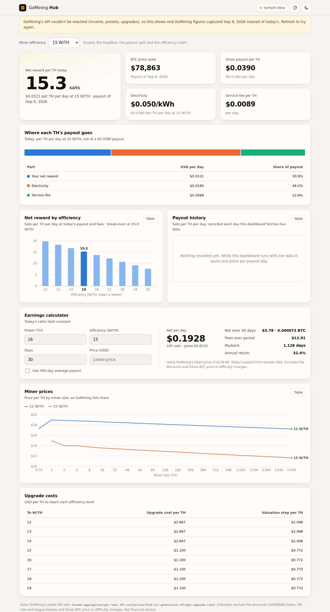

# GoMining Hub

A GoMining dashboard and an MCP server for Claude, built on one shared data layer, so the numbers on screen and the numbers Claude quotes always match.

- **Dashboard**: today's net reward per TH, where each TH's payout goes (net, electricity, service), net reward by efficiency, an earnings and payback calculator, miner prices by size, payout history and upgrade costs. Light and dark mode, works on a phone.
- **MCP server**: the same data as tools Claude can call, plus a passthrough for your own GoMining account endpoints.



```
gomining-hub/
  src/core/      GoMining client, calculations, cached market service (shared)
  src/web/       dashboard server (no dependencies) and JSON API
  src/mcp/       MCP server for Claude
  public/        dashboard page, styles and SVG charts
  data/          offline snapshot; history.json is written here at runtime
  deploy/        VPS install: systemd service, Caddy/nginx site, preflight check
  test/          node:test suite against a fake GoMining API
```

## Run it

Requires Node.js 20 or newer.

```bash
cd gomining-hub
npm install
npm test
npm start          # dashboard at http://127.0.0.1:4173
```

`PORT` and `HOST` change where the dashboard listens. It binds to localhost by default.

## Where the data comes from

Three public GoMining endpoints, the same ones app.gomining.com calls without logging in:

| Endpoint | Gives |
|---|---|
| `POST /api/nft-income-aggregation/get-last` | Daily payout per TH, the BTC price used, electricity and service fees |
| `GET /api/nft-collection/find-all-generative` | Miners GoMining sells, with prices |
| `POST /api/nft/get-upgrade-rate` | Per-W/TH valuation and upgrade price tables |

Results are cached for 5 minutes. The refresh button skips the cache.

**When GoMining can't be reached**, each part falls back to `data/sample-snapshot.json`: real GoMining responses captured on 9 Sep 2026 (via the public [gmt-calculator](https://github.com/sergeevpasha/gmt-calculator) snapshot). The dashboard shows a yellow "Sample data" badge and a notice, and every MCP tool returns `dataSource: "sample"`, so sample figures are never passed off as today's.

**Payout history**: GoMining's API has no history endpoint. Each day the hub fetches a live payout it saves one point to `data/history.json`, keyed by payout date, so the history chart builds up while you use it.

**Estimates**: net = payout − electricity (per W/TH × your W/TH) − service fee, per TH per day, with today's rates held constant. Fee discounts (paying in GOMINING, VIP level, clan and league boosts) and future BTC price or difficulty changes are not included, so the net figure is a conservative baseline.

## Dashboard API

| Route | Returns |
|---|---|
| `GET /api/market` | Payout, miner prices, upgrade tables, efficiency curve, data source. `?refresh=1` skips the cache |
| `GET /api/history` | Recorded payout days |
| `GET /api/earnings?powerTh=16&efficiencyWth=15&days=30[&priceUsd=250][&average=1]` | Earnings and payback |

The account passthrough is not exposed over HTTP. Only the MCP server, which runs locally inside Claude, can use your token.

## Connect the MCP server to Claude

### Claude Desktop

Edit `claude_desktop_config.json` (Windows: `%APPDATA%\Claude\claude_desktop_config.json`) and restart Claude Desktop:

```json
{
  "mcpServers": {
    "gomining": {
      "command": "node",
      "args": ["D:\\Projects\\atlas\\gomining-hub\\src\\mcp\\index.js"],
      "env": { "GOMINING_TOKEN": "" }
    }
  }
}
```

Change the path to wherever you cloned the repo. Leave `GOMINING_TOKEN` empty to use only the public tools.

### Claude Code

```bash
claude mcp add gomining -e GOMINING_TOKEN=your-token -- node /path/to/atlas/gomining-hub/src/mcp/index.js
```

### Tools

| Tool | What it does |
|---|---|
| `gomining_daily_reward` | Payout per TH (USD, sats), BTC price, electricity, service fee; optional per-TH split for one W/TH |
| `gomining_miner_prices` | Miners for sale, filterable by efficiency and budget |
| `gomining_upgrade_rates` | Valuation and upgrade cost tables per W/TH |
| `gomining_efficiency_curve` | Net per TH at 12–20 W/TH and the break-even efficiency |
| `gomining_calculate_earnings` | Daily and period net in USD, sats and BTC, payback and annual return |
| `gomining_payout_history` | Recorded payout days |
| `gomining_api_request` | Any `https://api.gomining.com/api/...` endpoint, with your token |
| `gomining_status` | Token set, writes allowed, live or sample data |

Try: "What does a 16 TH miner at 15 W/TH earn per month on GoMining, and when does it pay back?"

## Your account data (token)

GoMining has no public API key. The MCP server can use the bearer token the web app sends:

1. Log in at app.gomining.com in Chrome and open DevTools (F12), **Network** tab, filter `api.gomining.com`.
2. Click around (miners, wallet, clan) and select a request.
3. Under **Request Headers**, copy the `Authorization` value after `Bearer `.
4. Put it in `GOMINING_TOKEN` in your Claude config.

The token gives full access to your GoMining account, so treat it like a password. Keep it only in your local Claude config and never commit it. When calls start returning HTTP 401, the session has expired; copy a fresh token.

The account endpoints aren't documented, so find them in the same Network tab and ask Claude to call them through `gomining_api_request` with the path and body you see there.

**Safety limits**: the token is only ever sent to `https://api.gomining.com`, and absolute URLs, `//host` and `..` paths are refused. Public market calls never send it. `PUT`, `PATCH` and `DELETE` are blocked unless `GOMINING_ALLOW_WRITES=1`. GoMining also uses `POST` for some actions, so check what an endpoint does before asking Claude to call it.

## Configuration

| Variable | Default | Purpose |
|---|---|---|
| `GOMINING_TOKEN` | unset | Bearer token for account endpoints (MCP only). A leading `Bearer ` is stripped |
| `GOMINING_BASE_URL` | `https://api.gomining.com/api` | API base URL |
| `GOMINING_ALLOW_WRITES` | unset | `1` allows PUT, PATCH and DELETE through `gomining_api_request` |
| `PORT` / `HOST` | `4173` / `127.0.0.1` | Where the dashboard listens |
| `GOMINING_HISTORY_PATH` | `data/history.json` | Where recorded payout days are saved |

## Deploy to gooses.online

The `deploy/` folder puts the dashboard on your VPS behind HTTPS. It contains no credentials and doesn't need any from this repo; you run it on the VPS yourself.

1. **Point DNS at the VPS.** At your domain registrar, add an `A` record for the name you want (e.g. `hub` → `hub.gooses.online`, or `@` for `gooses.online` itself) with the VPS's IP address.
2. **Copy the project to the VPS**, from your PC with the same SSH access you already use, e.g. `git clone` on the VPS, or `scp -r gomining-hub user@your-vps:~/`.
3. **Check the server first** (read-only, changes nothing):
   ```bash
   bash deploy/check.sh hub.gooses.online
   ```
   Shows the OS, Node version, which web server is running, what uses ports 80/443, the running bots, and whether DNS already points here.
4. **Install:**
   ```bash
   sudo bash deploy/install.sh hub.gooses.online
   ```
   Creates a locked `gominghub` system user, copies the app to `/opt/gomining-hub`, starts the `gomining-hub` service on `127.0.0.1:4173`, and adds one site to Caddy or nginx (whichever is running) with HTTPS. If the web server's config test fails, it restores the previous config and reloads nothing. It doesn't stop, change or restart other services such as the Goose Discord bot.
5. **Update later:** pull the new code and run the same install command again. Payout history in `/var/lib/gomining-hub/` is kept.

Useful commands: `systemctl status gomining-hub`, `journalctl -u gomining-hub -f`.

### Security on the VPS

- The dashboard serves public GoMining data only. It never loads `GOMINING_TOKEN`, even if one is set, and has no route that can reach your account.
- It listens on `127.0.0.1` only; Caddy or nginx is the only thing exposed.
- The service runs as an unprivileged user with a read-only filesystem except its history folder.
- Responses carry a strict Content-Security-Policy and refuse framing.
- A forced refresh is limited to once a minute, so the public refresh button can't be used to hammer GoMining.
- Keep the MCP server (and your token) on your own computer, not the VPS.

### Keeping secrets out of the repo

`npm test` includes a scan of every file in the repository for private keys, tokens (GoMining, GitHub, Discord, Telegram, Anthropic, AWS), hard-coded passwords and public IP addresses, and fails if it finds one. `.gitignore` also excludes `.env` files, keys and certificates. Server addresses and credentials stay on your PC and on the VPS.

## Design notes

Warm paper in light mode and graphite in dark mode, ink-and-hairline chrome with one amber brand mark, so the data carries the color. Chart colors are three validated slots (blue, orange, aqua) with separate light and dark steps. Every chart has a hover/focus tooltip and a table view, and the payout split is labelled in a table, because aqua is below 3:1 contrast on the light surface.
